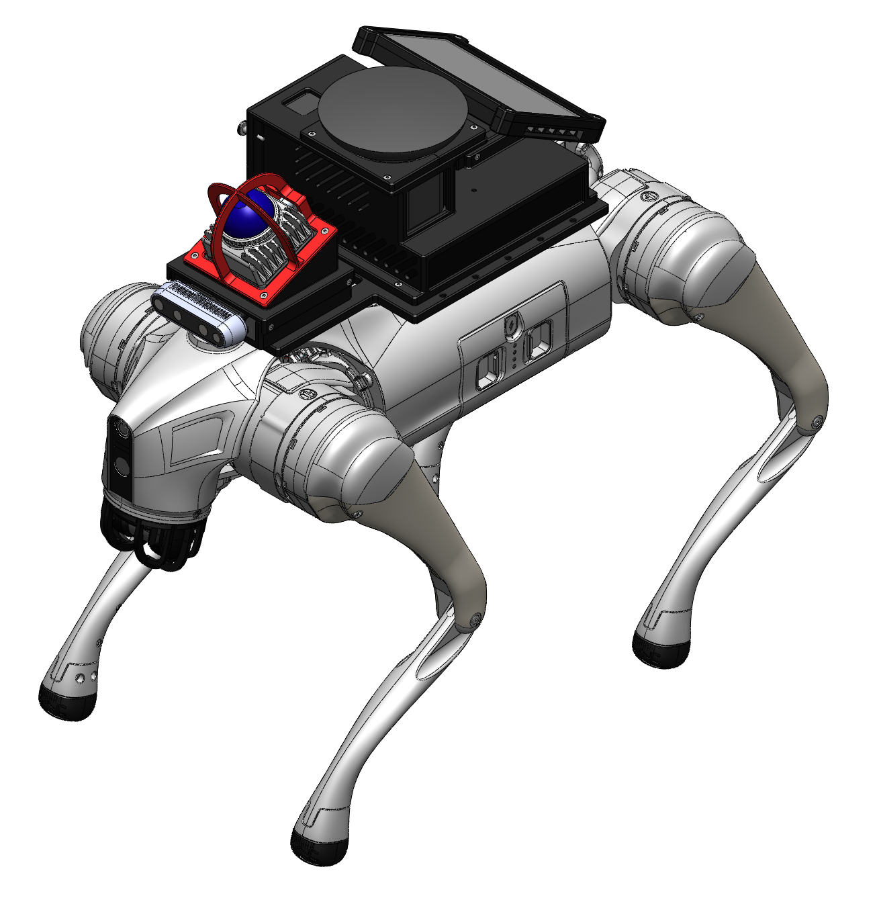
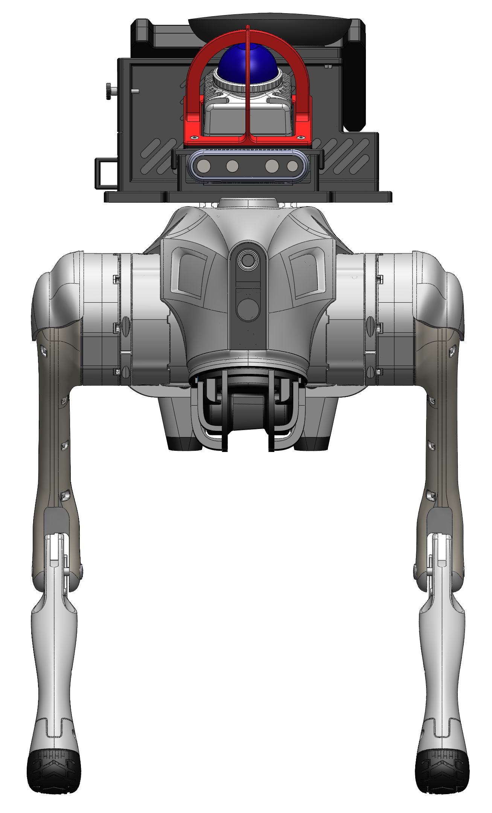
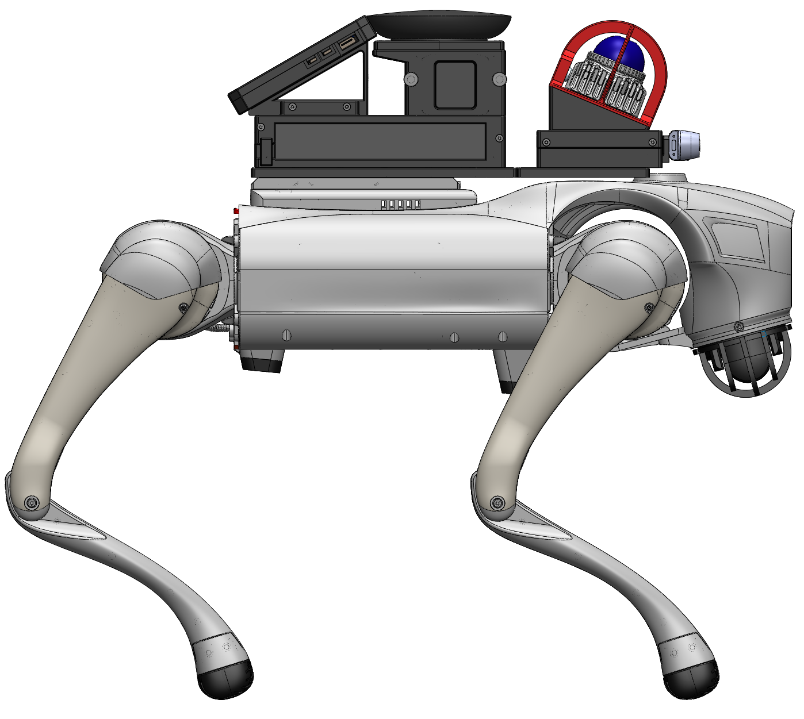
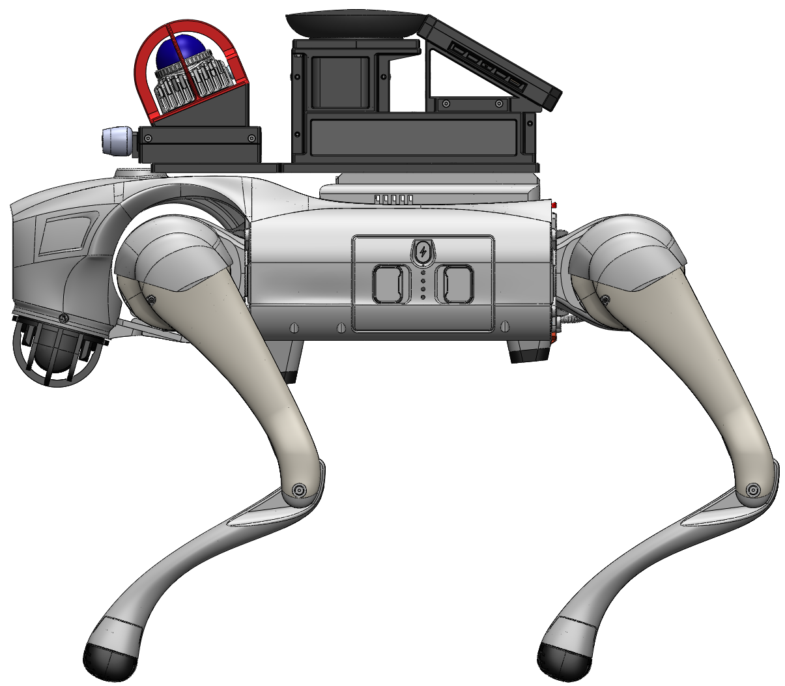

# Driving Flow — Hardware

Custom mounting hardware for the Driving Flow autonomous navigation platform, built on the [Unitree Go2 EDU](https://www.unitree.com/go2/) quadruped robot. All custom parts are designed in SolidWorks and 3D-printable.

<p align="center">
  
</p>

## Overview

The payload mounts a Livox Mid-360 LiDAR, Intel RealSense D435i depth camera, Lenovo ThinkCentre M910q computer, an Anker 737 power bank, a Jabra Speak speakerphone, and a Raspberry Pi 7" touchscreen display onto the Go2's back. All custom parts bolt together with M3 screws and attach to the robot's existing mounting rails.

## Repository Structure

```
├── final/              # Custom-designed parts and assemblies
├── oem_cad/            # OEM reference models for off-the-shelf components
├── fasteners/          # McMaster-Carr fastener models
└── pictures/           # Rendered views of the assembly
```

## Custom Parts (`final/`)

| File | Description |
|---|---|
| `base_plate.SLDPRT` | Main plate that bolts to the Go2 mounting rails |
| `mounting_surface_bottom.SLDPRT` | Lower mounting surface for the perception stack |
| `mounting_surface_top.SLDPRT` | Upper mounting surface for the perception stack |
| `lidar_cage.SLDPRT` | Protective cage enclosing the Livox Mid-360 LiDAR |
| `depth_cam_mount_v2.SLDPRT` | Bracket for the Intel RealSense D435i depth camera |
| `pc_power_mount_v2.SLDPRT` | Enclosure holding the ThinkCentre and Anker 737 power bank |
| `pc_power_mount_brace.SLDPRT` | Two-piece lid for the compute/power enclosure |
| `display_enclosure_bottom.SLDPRT` | Lower half of the touchscreen display housing |
| `display_enclosure_top.SLDPRT` | Upper half of the touchscreen display housing |
| `jabra_speak.SLDPRT` | Reference model of the Jabra Speak speakerphone |
| `jabra_speak_enclosure.SLDPRT` | Enclosure for the Jabra Speak |
| `perception_mount.SLDASM` | Sub-assembly: LiDAR cage + depth camera mount |
| `screen_mount.SLDASM` | Sub-assembly: display enclosure top + bottom |
| `hardware_assembly.SLDASM` | Full payload assembly without perception stack |
| `Top_Level.SLDASM` | Complete assembly including Go2 and all components |

## OEM Reference Models (`oem_cad/`)

| File | Component |
|---|---|
| `Livox_MID360.SLDASM` | Livox Mid-360 LiDAR |
| `RealSense_D435i.SLDPRT` | Intel RealSense D435i depth camera |
| `Lenovo_ThinkCenter_M910q.SLDPRT` | Lenovo ThinkCentre M910q mini PC |
| `Anker_737.SLDPRT` | Anker 737 power bank |
| `RaspberryPi_7inch_display.SLDPRT` | Raspberry Pi 7" touchscreen display |

## Fasteners (`fasteners/`)

All fasteners are sourced from [McMaster-Carr](https://www.mcmaster.com/). Part numbers are embedded in the filenames.

| McMaster P/N | Description |
|---|---|
| 91292A111 | M3 × 8 mm 18-8 SS socket head cap screw |
| 91292A112 | M3 × 10 mm 18-8 SS socket head cap screw |
| 91292A113 | M3 × 12 mm 18-8 SS socket head cap screw |
| 91292A123 | M3 × 50 mm 18-8 SS socket head cap screw |
| 92125A130 | M3 18-8 SS hex-drive flat head screw |
| 92558A340 | M3 SS raised knurled-head thumb screw |
| 90592A085 | M3 steel hex nut |

## Assembly

Refer to `Top_Level.SLDASM` for the full assembled view with all mating relationships.

## Gallery

| | |
|---|---|
|  |  |
|  |  |

## Related Repositories

| Repository | Description |
|---|---|
| [DrivingFlow/FAST_LIO_MAP](https://github.com/DrivingFlow/FAST_LIO_MAP) | LiDAR SLAM mapping pipeline |
| [DrivingFlow/FAST_LIO_LOCALIZATION](https://github.com/DrivingFlow/FAST_LIO_LOCALIZATION) | ICP-based localization |
| [DrivingFlow/path_planning](https://github.com/DrivingFlow/path_planning) | Occupancy grid path planner |
| [DrivingFlow/grid-goat](https://github.com/DrivingFlow/grid-goat) | Transformer-based map updater model |
| [DrivingFlow/Controls](https://github.com/DrivingFlow/Controls) | Pure Pursuit + PD heading controller |

## License

This project was developed as part of ENPH 479 at the University of British Columbia.
